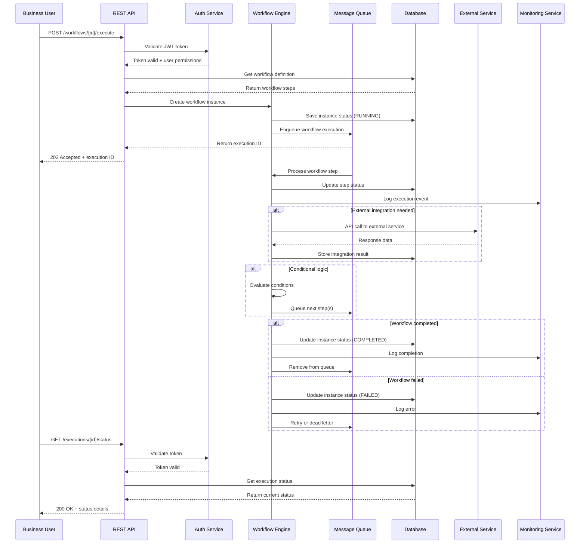
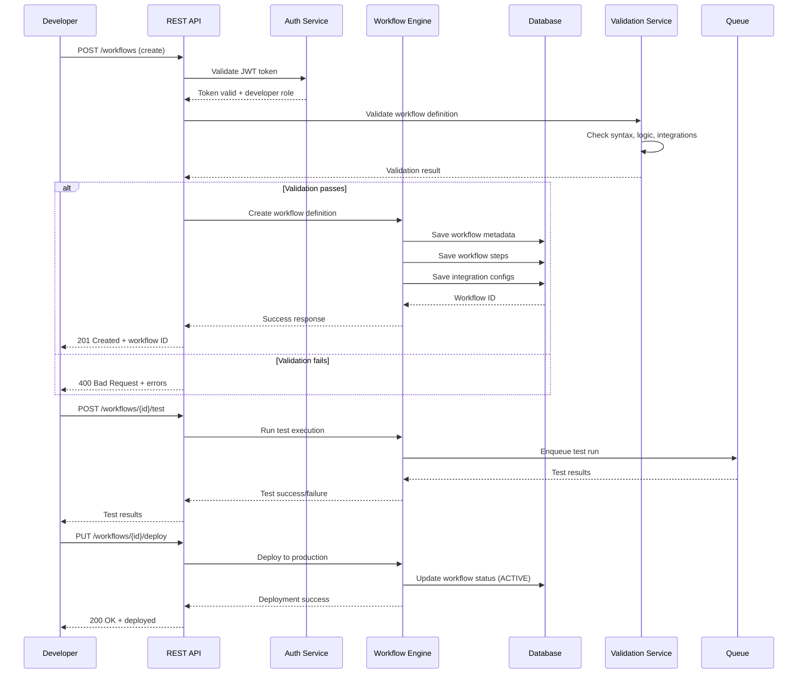
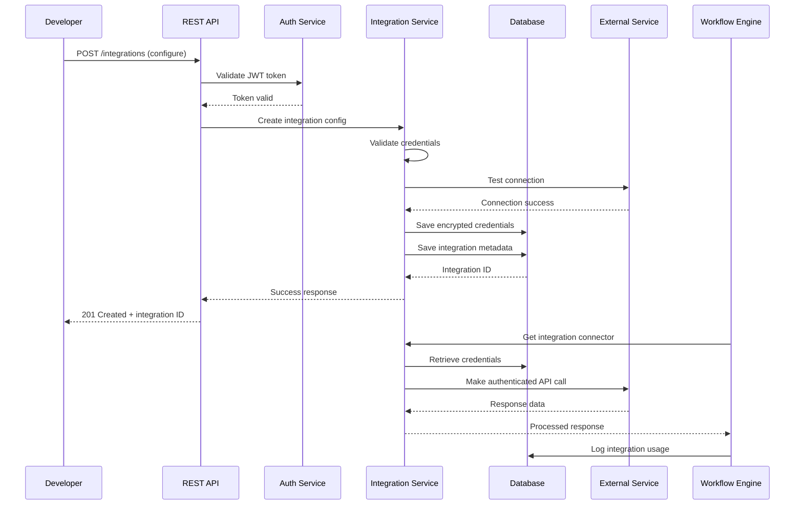
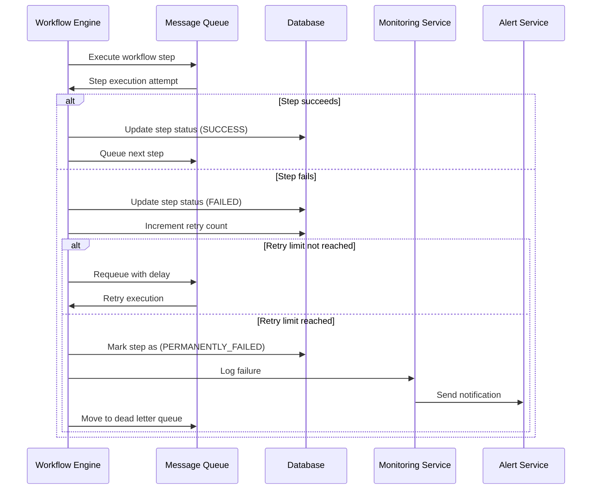

# Sequence Diagram - Workflow Automation Engine

## Main Flow: End-to-End Workflow Execution

```mermaid
sequenceDiagram
    participant User as Business User
    participant API as REST API
    participant Auth as Auth Service
    participant Engine as Workflow Engine
    participant Queue as Message Queue
    participant DB as Database
    participant Ext as External Service
    participant Monitor as Monitoring Service

    User->>API: POST /workflows/{id}/execute
    API->>Auth: Validate JWT token
    Auth-->>API: Token valid + user permissions
    API->>DB: Get workflow definition
    DB-->>API: Return workflow steps
    API->>Engine: Create workflow instance
    Engine->>DB: Save instance status (RUNNING)
    Engine->>Queue: Enqueue workflow execution
    Queue-->>API: Return execution ID
    API-->>User: 202 Accepted + execution ID

    %% Async execution
    Queue->>Engine: Process workflow step
    Engine->>DB: Update step status
    Engine->>Monitor: Log execution event
    
    alt External integration needed
        Engine->>Ext: API call to external service
        Ext-->>Engine: Response data
        Engine->>DB: Store integration result
    end
    
    alt Conditional logic
        Engine->>Engine: Evaluate conditions
        Engine->>Queue: Queue next step(s)
    end
    
    alt Workflow completed
        Engine->>DB: Update instance status (COMPLETED)
        Engine->>Monitor: Log completion
        Engine->>Queue: Remove from queue
    else Workflow failed
        Engine->>DB: Update instance status (FAILED)
        Engine->>Monitor: Log error
        Engine->>Queue: Retry or dead letter
    end

    %% User monitoring
    User->>API: GET /executions/{id}/status
    API->>Auth: Validate token
    Auth-->>API: Token valid
    API->>DB: Get execution status
    DB-->>API: Return current status
    API-->>User: 200 OK + status details
```

## Workflow Creation Flow

```mermaid
sequenceDiagram
    participant Dev as Developer
    participant API as REST API
    participant Auth as Auth Service
    participant Engine as Workflow Engine
    participant DB as Database
    participant Validator as Validation Service

    Dev->>API: POST /workflows (create)
    API->>Auth: Validate JWT token
    Auth-->>API: Token valid + developer role
    API->>Validator: Validate workflow definition
    Validator->>Validator: Check syntax, logic, integrations
    Validator-->>API: Validation result
    
    alt Validation passes
        API->>Engine: Create workflow definition
        Engine->>DB: Save workflow metadata
        Engine->>DB: Save workflow steps
        Engine->>DB: Save integration configs
        DB-->>Engine: Workflow ID
        Engine-->>API: Success response
        API-->>Dev: 201 Created + workflow ID
    else Validation fails
        API-->>Dev: 400 Bad Request + errors
    end

    Dev->>API: POST /workflows/{id}/test
    API->>Engine: Run test execution
    Engine->>Queue: Enqueue test run
    Queue-->>Engine: Test results
    Engine-->>API: Test success/failure
    API-->>Dev: Test results

    Dev->>API: PUT /workflows/{id}/deploy
    API->>Engine: Deploy to production
    Engine->>DB: Update workflow status (ACTIVE)
    Engine-->>API: Deployment success
    API-->>Dev: 200 OK + deployed
```

## Integration Management Flow

```mermaid
sequenceDiagram
    participant Dev as Developer
    participant API as REST API
    participant Auth as Auth Service
    participant Int as Integration Service
    participant DB as Database
    participant Ext as External Service

    Dev->>API: POST /integrations (configure)
    API->>Auth: Validate JWT token
    Auth-->>API: Token valid
    API->>Int: Create integration config
    Int->>Int: Validate credentials
    Int->>Ext: Test connection
    Ext-->>Int: Connection success
    Int->>DB: Save encrypted credentials
    Int->>DB: Save integration metadata
    DB-->>Int: Integration ID
    Int-->>API: Success response
    API-->>Dev: 201 Created + integration ID

    %% During workflow execution
    participant Engine as Workflow Engine
    Engine->>Int: Get integration connector
    Int->>DB: Retrieve credentials
    Int->>Ext: Make authenticated API call
    Ext-->>Int: Response data
    Int-->>Engine: Processed response
    Engine->>DB: Log integration usage
```

## Error Handling & Retry Flow

```mermaid
sequenceDiagram
    participant Engine as Workflow Engine
    participant Queue as Message Queue
    participant DB as Database
    participant Monitor as Monitoring Service
    participant Alert as Alert Service

    Engine->>Queue: Execute workflow step
    Queue->>Engine: Step execution attempt
    
    alt Step succeeds
        Engine->>DB: Update step status (SUCCESS)
        Engine->>Queue: Queue next step
    else Step fails
        Engine->>DB: Update step status (FAILED)
        Engine->>DB: Increment retry count
        
        alt Retry limit not reached
            Engine->>Queue: Requeue with delay
            Queue->>Engine: Retry execution
        else Retry limit reached
            Engine->>DB: Mark step as (PERMANENTLY_FAILED)
            Engine->>Monitor: Log failure
            Monitor->>Alert: Send notification
            Engine->>Queue: Move to dead letter queue
        end
    end
```
