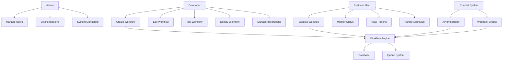

# Use Case Diagram - Workflow Automation Engine

## Actors
- **Admin**: System administrator with full access
- **Developer**: Creates and manages workflows
- **Business User**: Executes and monitors workflows
- **External System**: Third-party services via API

## Use Cases

### Admin
- **Manage Users**: Create, update, delete user accounts
- **Set Permissions**: Configure role-based access control
- **System Monitoring**: View system health and metrics
- **Backup & Restore**: Manage data backups

### Developer
- **Create Workflow**: Design new workflow definitions
- **Edit Workflow**: Modify existing workflow logic
- **Test Workflow**: Run workflow in test environment
- **Deploy Workflow**: Move workflow to production
- **Manage Integrations**: Configure external service connections
- **Version Control**: Track workflow changes

### Business User
- **Execute Workflow**: Start workflow instances
- **Monitor Status**: Track workflow progress
- **View Reports**: Access execution analytics
- **Handle Approvals**: Approve/reject workflow steps
- **View History**: Access past execution logs

### External System
- **API Integration**: Connect via REST endpoints
- **Webhook Events**: Send/receive workflow triggers
- **Data Exchange**: Sync workflow data

## Use Case Relationships

## Key Workflows

### 1. Workflow Creation
1. Developer logs in
2. Creates new workflow definition
3. Adds workflow steps and conditions
4. Configures integrations
5. Tests workflow
6. Deploys to production

### 2. Workflow Execution
1. Business user triggers workflow
2. Workflow engine processes steps
3. External integrations are called
4. Status updates are logged
5. User monitors progress
6. Workflow completes or fails

### 3. Integration Management
1. Developer configures external service
2. Sets authentication credentials
3. Tests connection
4. Maps data fields
5. Saves integration configuration